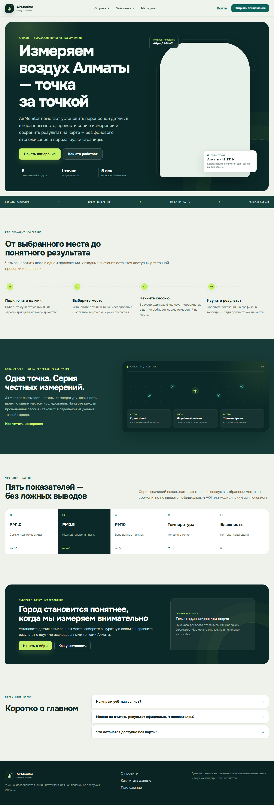
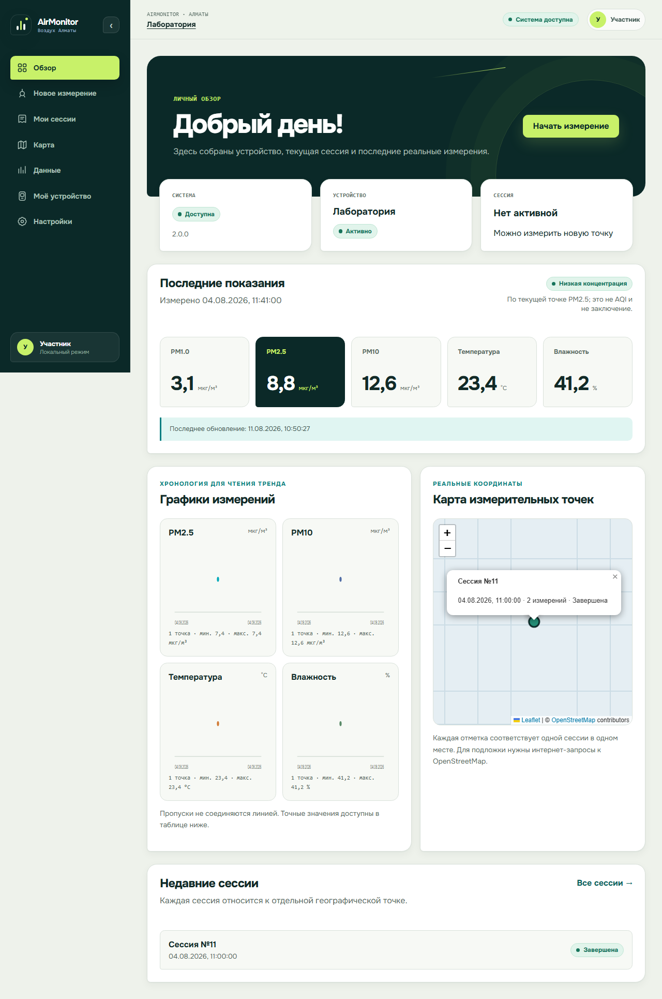
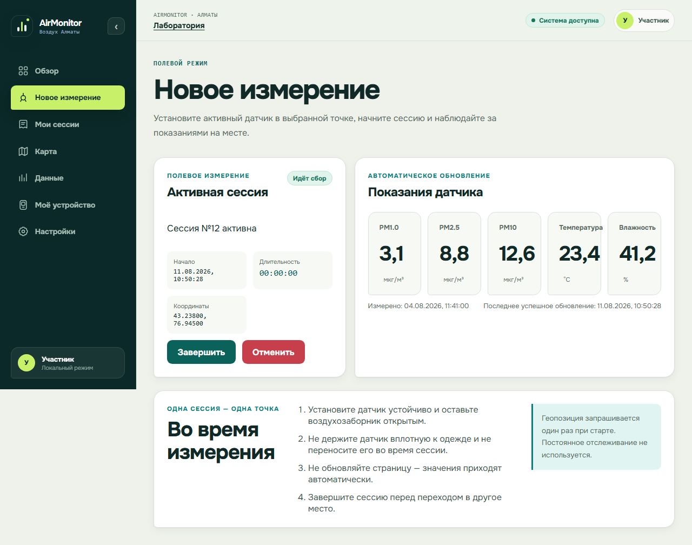
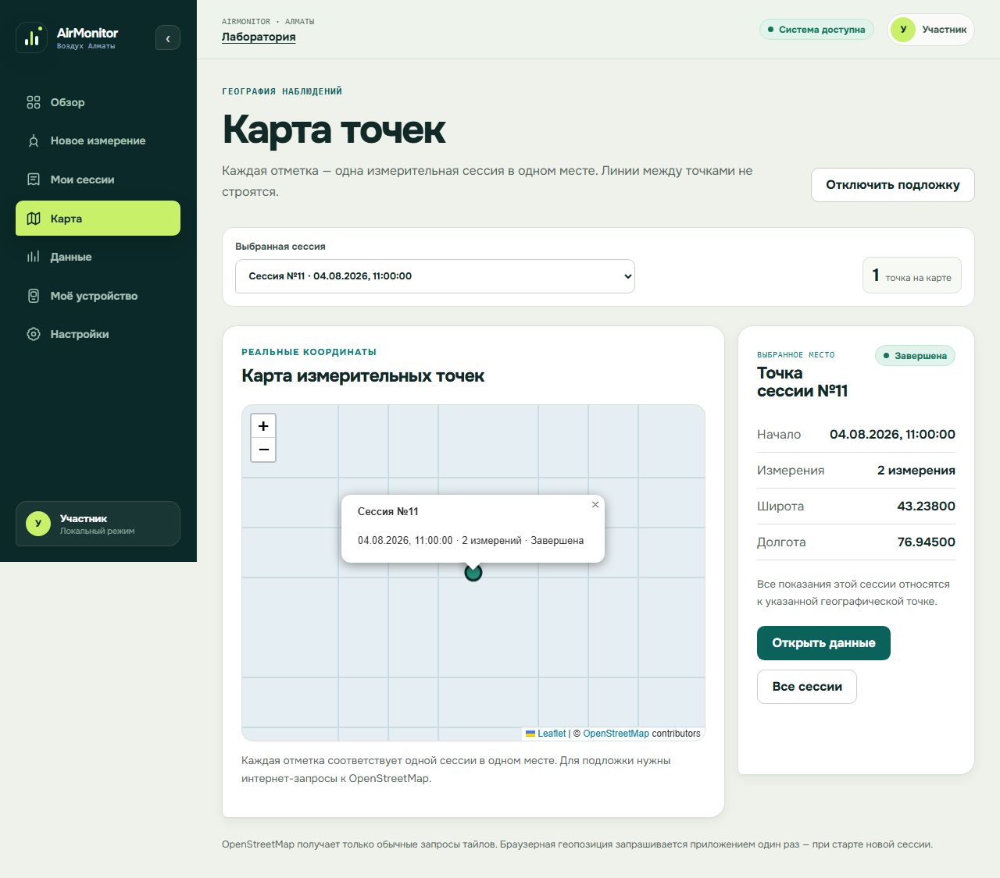
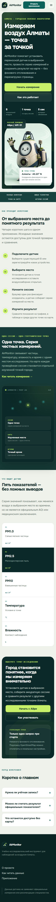
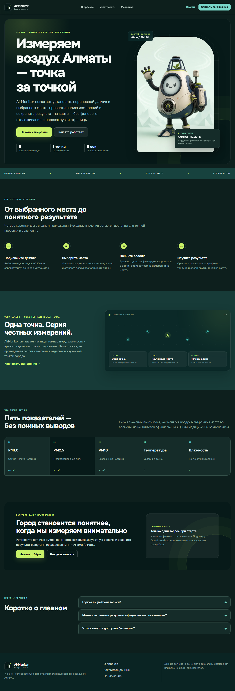

# AirMonitor

**Portable IoT platform for air-quality and urban microclimate monitoring.**

AirMonitor is an end-to-end IoT system that combines an ESP32-based measurement
device, a FastAPI backend, PostgreSQL storage, and a React dashboard for
collecting, storing, and visualizing environmental telemetry.

The device is portable and can be moved between selected locations, while each
measurement session itself is stationary and associated with one geographic
point.



---

## Overview

AirMonitor collects environmental data from a physical sensor device, sends it
to a backend API, stores it in PostgreSQL, and presents the measurements through
a web application.

AirMonitor v2 includes:

- firmware for M5Stack Basic / ESP32;
- PMSA003 particulate-matter sensor integration;
- SHT30 temperature and humidity sensor integration;
- Wi-Fi telemetry delivery;
- FastAPI REST backend;
- PostgreSQL persistence;
- Alembic database migrations;
- React + TypeScript dashboard;
- live telemetry and measurement history;
- charts and geographic measurement points;
- Docker Compose local environment;
- automated backend, frontend, integration, and firmware verification.

The project started as an academic prototype and has since been redesigned with
a new backend, database layer, frontend, firmware, testing strategy, and
containerized runtime.

---

## Key Features

### IoT Device

- M5Stack Basic / ESP32 firmware written in C++;
- PMSA003 particulate sensor;
- SHT30 temperature and humidity sensor;
- configurable Wi-Fi and API settings;
- UTC timestamps;
- session-aware telemetry delivery;
- idempotent measurement delivery;
- bounded in-memory outbox for temporary network failures.

### Backend

- FastAPI REST API;
- asynchronous PostgreSQL access;
- SQLAlchemy repository layer;
- Alembic migrations;
- request validation and structured error handling;
- device lifecycle management;
- measurement-session lifecycle;
- raw telemetry ingestion;
- session and measurement history;
- opaque keyset pagination;
- OpenAPI 3.1 contract.

### Frontend

- React + TypeScript;
- responsive participant dashboard;
- public project pages;
- device connection workflow;
- measurement-session controls;
- live telemetry;
- historical measurements;
- charts and statistics;
- session history;
- map-based measurement-point visualization;
- light and dark themes;
- responsive mobile layout;
- automated frontend and E2E testing.

### Infrastructure

- Dockerized backend;
- Dockerized frontend;
- PostgreSQL service;
- Docker Compose stack;
- automatic database migrations;
- container health checks;
- non-root application containers;
- GitHub Actions CI.

---

## Tech Stack

| Area | Technologies |
|---|---|
| Backend | Python, FastAPI, SQLAlchemy, Alembic |
| Database | PostgreSQL |
| API | REST, OpenAPI |
| Frontend | React, TypeScript, Vite |
| Testing | pytest, Vitest, Playwright |
| Infrastructure | Docker, Docker Compose, GitHub Actions |
| Firmware | C++, PlatformIO, Arduino-ESP32 |
| Hardware | M5Stack Basic / ESP32, PMSA003, SHT30 |
| Maps | Leaflet |

---

## System Architecture

```text
PMSA003 + SHT30
       │
       ▼
M5Stack Basic / ESP32
       │
       │ Wi-Fi / HTTP(S)
       ▼
     FastAPI
       │
       ▼
Application Services
       │
       ▼
Repositories
       │
       ▼
SQLAlchemy AsyncSession
       │
       ▼
   PostgreSQL
       │
       ▼
React / TypeScript Dashboard
```

The backend uses a layered architecture:

```text
HTTP Route
   │
   ├── validation
   ├── dependency injection
   ▼
Application Service
   ▼
Repository
   ▼
SQLAlchemy AsyncSession
   ▼
PostgreSQL
```

Application services own transaction boundaries while repositories focus on
database operations.

---

## Measurement Model

AirMonitor is portable, but each measurement session represents a **stationary
measurement point**.

```text
Move device to selected location
            │
            ▼
Start measurement session
            │
            ▼
Capture geographic coordinates
            │
            ▼
Collect environmental telemetry
            │
            ▼
Store measurements under the session
            │
            ▼
Complete session
            │
            ▼
Move device to the next location
```

Coordinates are fixed when the session starts.

AirMonitor does not continuously track movement or construct a route while a
measurement session is active.

---

## Screenshots

### Dashboard



### Active Measurement



### Measurement Map



### Mobile Interface



### Dark Theme



--- 

## API

AirMonitor v2 currently exposes 11 OpenAPI operations, including the health
endpoint and versioned `/api/v1` API.

Main API areas include:

```text
/health

/api/v1/devices
/api/v1/devices/{device_id}

/api/v1/devices/{device_id}/sessions
/api/v1/devices/{device_id}/measurements
```

Supported workflows include:

- device creation and retrieval;
- device activation and deactivation;
- session start;
- active-session lookup;
- session completion and cancellation;
- telemetry ingestion;
- session history;
- measurement history.

Detailed contracts are available in [`docs/specs`](docs/specs/).

---

## Telemetry Pagination

Historical telemetry uses opaque keyset pagination rather than traditional
offset pagination.

The implementation uses:

- stable descending ordering;
- opaque cursors;
- bounded `limit + 1` repository reads;
- strict query validation;
- database indexes designed for supported read patterns.

See the
[Telemetry Read API specification](docs/specs/telemetry-read-api.md)
for additional details.

---

## Running Locally

### Requirements

You need:

- Docker;
- Docker Compose;
- Git.

Clone the repository:

```bash
git clone https://github.com/COFFICUN/AirMonitor.git
cd AirMonitor
```

Create a local environment file.

Linux/macOS:

```bash
cp .env.example .env
```

Windows PowerShell:

```powershell
Copy-Item .env.example .env
```

Review the example configuration and start the stack:

```bash
docker compose up --build
```

The stack starts PostgreSQL, applies database migrations, starts the FastAPI
service, and serves the frontend.

### Useful Commands and Endpoints

The local stack is defined in [`compose.yaml`](compose.yaml).

The backend container is built from
[`backend/Dockerfile`](backend/Dockerfile).

Start the complete stack:

```bash
docker compose up --build
```

Stop the stack:

```bash
docker compose down
```

After startup, the backend is available at:

- Health check: http://127.0.0.1:8000/health
- OpenAPI schema: http://127.0.0.1:8000/openapi.json

The current Alembic migration head is:

```text
a75caa2b44f5
```

---

## Firmware

Firmware v2 is located in:

```text
firmware/
```

It is built with PlatformIO for the ESP32 platform.

Device-specific secrets and connection settings are not committed to Git.

Start from:

```text
firmware/include/firmware_config.example.h
```

More information is available in
[`firmware/README.md`](firmware/README.md).

---

## Testing

AirMonitor contains automated verification at several levels.

```text
Backend
├── unit tests
├── service tests
├── repository tests
├── API contract tests
├── OpenAPI tests
├── migration tests
└── PostgreSQL integration tests

Frontend
├── component tests
├── API client tests
├── feature tests
├── accessibility checks
└── Playwright E2E tests

Firmware
├── native logic tests
└── static source checks
```

PostgreSQL integration tests are guarded so destructive operations run only
against explicitly disposable test databases.

---

## Continuous Integration

GitHub Actions automatically verifies important parts of the project.

The CI pipeline covers:

- backend verification;
- PostgreSQL integration;
- API contracts;
- frontend verification;
- container-related checks;
- firmware verification.

---

## Repository Structure

```text
AirMonitor/
├── .github/
│   └── workflows/
│
├── backend/
│   ├── alembic/
│   ├── app/
│   └── tests/
│
├── frontend/
│   ├── e2e/
│   ├── public/
│   └── src/
│
├── firmware/
│   ├── include/
│   ├── src/
│   └── test/
│
├── docs/
│   ├── assets/
│   │   └── screenshots/
│   └── specs/
│
├── compose.yaml
├── .env.example
├── README.md
└── LICENSE
```

The repository also contains the original AirMonitor v1 prototype at the root
for historical reference.

Active development targets AirMonitor v2 under:

- `backend/`;
- `frontend/`;
- `firmware/`.

---

## Documentation

Public engineering specifications:

- [Telemetry Read API](docs/specs/telemetry-read-api.md)
- [Firmware v2 API](docs/specs/firmware-v2-api.md)
- [Frontend v2 specification](docs/specs/frontend-user-redesign.md)
- [Authentication future scope](docs/specs/authentication-future-scope.md)

---

## Current Limitations

AirMonitor v2 is still evolving.

Current known limitations include:

- authentication and user accounts are not part of the current MVP;
- production deployment infrastructure is not yet included;
- device provisioning remains configuration-based;
- multi-user workflows are not yet implemented;
- multi-device user workflows remain future scope.

These capabilities are intentionally presented as future work rather than
completed functionality.

---

## Roadmap

Planned development includes:

- authentication and authorization;
- user accounts;
- multi-device support;
- improved device provisioning;
- production deployment;
- monitoring and observability;
- further firmware reliability improvements;
- wider real-world field testing.

---

## Legacy v1

The original AirMonitor prototype used:

- Flask;
- SQLite;
- an earlier browser interface;
- earlier firmware.

The v1 files remain in the repository as historical reference material.

AirMonitor v2 does not depend on the legacy Flask/SQLite application.

---

## License

This project is distributed under the terms of the repository
[LICENSE](LICENSE).