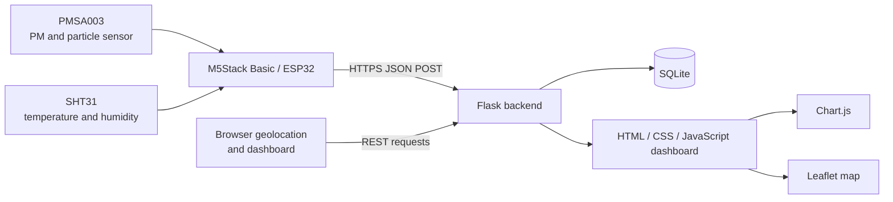

# AirMonitor

AirMonitor is a portable IoT system for collecting, storing, and visualizing air-quality and urban microclimate measurements.

The project combines an ESP32-based M5Stack device, a PMSA003 particulate-matter sensor, an SHT31 temperature and humidity sensor, a Flask backend, a SQLite database, and a browser-based dashboard with charts, AQI indicators, measurement sessions, and geolocation-based map views.

> **Project status:** this repository contains the original diploma implementation, preserved as **AirMonitor v1.0**. A portfolio-oriented v2.0 is planned with FastAPI, PostgreSQL, SQLAlchemy, Alembic, Docker, automated tests, and CI/CD.

## Main capabilities

- Measures PM1.0, PM2.5, PM10, temperature, humidity, and particle counts.
- Displays live sensor values and device status on the M5Stack screen.
- Sends JSON measurements from the ESP32 to the backend over Wi-Fi.
- Starts and stops geolocated measurement sessions from the web interface.
- Stores raw measurements and session summaries in SQLite.
- Calculates PM2.5-based AQI and a simplified EPA NowCast estimate.
- Builds a smoothed PM2.5 chart for the latest session.
- Shows AQI markers, approximate zones, and a measurement route on a Leaflet map.
- Exports completed sessions to CSV.
- Provides health and status endpoints for diagnostics.

## System architecture



## Hardware

| Component | Purpose |
|---|---|
| M5Stack Basic v2.7 / ESP32 | Main controller, Wi-Fi communication, and local display |
| PMSA003 | PM1.0, PM2.5, PM10, and particle-count measurements |
| SHT31 | Temperature and relative-humidity measurements |
| USB power bank | Portable power supply |

### Sensor connections

| Sensor pin | M5Stack / ESP32 pin |
|---|---|
| PMSA003 VCC | 5 V |
| PMSA003 GND | GND |
| PMSA003 TXD | GPIO16 / RX2 |
| PMSA003 RXD | GPIO17 / TX2 |
| SHT31 VDD | 3.3 V or 5 V, depending on the module |
| SHT31 GND | GND |
| SHT31 SDA | GPIO21 |
| SHT31 SCL | GPIO22 |

## Firmware behavior

The Arduino sketch is stored in `test1_final.ino`.

- Sensor readings are refreshed every 2 seconds.
- Measurements are sent automatically every 5 seconds.
- The interface is refreshed approximately every 800 ms.
- Wi-Fi reconnection is checked every 10 seconds.
- PM values are smoothed with a five-sample buffer before display and transmission.
- Button A switches between the main, particle-count, and system-status screens.
- Button B performs a manual measurement upload.
- Button C enables or disables automatic server uploads.

The firmware sends payloads similar to:

```json
{
  "device_uid": "airmonitor-main",
  "sent_at_utc": "2026-07-21T07:00:00Z",
  "temperature": 24.6,
  "humidity": 42.1,
  "pm1": 8,
  "pm25": 14,
  "pm10": 19,
  "pc0_3": 1024,
  "pc0_5": 340,
  "pc1_0": 81,
  "pc2_5": 12,
  "pc5_0": 2,
  "pc10": 0
}
```

The backend assigns latitude and longitude from the active browser-controlled measurement session rather than trusting coordinates sent by the device.

## Technology stack

### Firmware

- C++ / Arduino
- M5Stack library
- WiFi and HTTPClient
- ArduinoJson
- Adafruit SHT31
- Plantower PMS7003-compatible library

### Backend

- Python 3.13
- Flask 3.1
- SQLite
- Python `zoneinfo` with `tzdata`

### Frontend

- HTML, CSS, and JavaScript in a single template
- Bootstrap 5
- Font Awesome
- Chart.js
- Leaflet

## Repository structure

```text
AirMonitor/
├── app.py                 # Flask backend, REST endpoints, analytics, and HTML rendering
├── index.html             # Dashboard template with embedded CSS and JavaScript
├── test1_final.ino        # ESP32 / M5Stack firmware
├── secrets.example.h      # Public Wi-Fi credential template
├── init_db.py             # Creates a clean local SQLite database
├── schema.sql             # Database schema and default device record
├── requirements.txt       # Reproducible Python dependencies
├── .gitignore             # Excludes credentials, certificates, databases, and local files
├── .gitattributes         # Normalizes text files and line endings
├── LICENSE
└── README.md
```

The following local files are intentionally excluded from Git:

```text
.venv/
secrets.h
sensor_data.db
*.pem
*.key
.env
```

## Database model

The current application uses these primary entities:

| Table | Purpose |
|---|---|
| `devices` | Registered AirMonitor devices |
| `device_runtime_state` | Active session, measurement state, and current fixed coordinates |
| `raw_measurements` | Individual packets received from the ESP32 |
| `measurement_sessions` | Aggregated summary of a geolocated measurement session |
| `raw_session_links` | Links raw packets to their session |
| `aggregated_measurements` | Reserved legacy table for time-window aggregation |

The production database is not published because it can contain real geolocation and measurement history.

## REST endpoints

| Method | Endpoint | Purpose |
|---|---|---|
| `GET` | `/` | Render the dashboard |
| `POST` | `/start_measurement` | Start a session using browser latitude and longitude |
| `POST` | `/stop_measurement` | Stop the current session |
| `POST` | `/update_location` | Initialize or refresh the active measurement location |
| `POST` | `/update` | Receive a measurement packet from the ESP32 |
| `GET` | `/api/measurement-status` | Return the current measurement state |
| `GET` | `/api/location-status` | Return location and session status |
| `GET` | `/api/live` | Return the live dashboard payload |
| `GET` | `/api/chart` | Return chart data for the active or latest session |
| `GET` | `/api/map` | Return map points and route data |
| `GET` | `/api/nowcast` | Return the simplified NowCast result |
| `GET` | `/export/csv` | Export session summaries as CSV |
| `GET` | `/health` | Return server, device, and database diagnostics |

## Local setup on Windows

### 1. Clone the repository

```powershell
git clone https://github.com/YOUR_USERNAME/AirMonitor.git
cd AirMonitor
```

### 2. Create and activate a virtual environment

```powershell
py -3.13 -m venv .venv
Set-ExecutionPolicy -Scope Process -ExecutionPolicy Bypass
.\.venv\Scripts\Activate.ps1
```

### 3. Install Python dependencies

```powershell
python -m pip install --upgrade pip
python -m pip install -r requirements.txt
```

### 4. Create a local database

```powershell
python init_db.py
```

This creates `sensor_data.db` and registers the default device UID expected by the application:

```text
airmonitor-main
```

### 5. Configure local HTTPS files

The current v1.0 backend expects these local files next to `app.py`:

```text
172.20.10.4+2.pem
172.20.10.4+2-key.pem
```

They are intentionally excluded from Git. Use your own local certificate and key, then update the filenames in the `if __name__ == "__main__"` block of `app.py` when necessary.

The printed URL and the firmware server URL are also configured for the original iPhone hotspot network. Update them when your server uses another local IP address.

### 6. Run the backend

```powershell
python app.py
```

The Flask development server listens on all local interfaces on port `5000`.

## Firmware setup

### 1. Create the local credentials file

Copy the public template:

```powershell
Copy-Item .\secrets.example.h .\secrets.h
```

Edit `secrets.h`:

```cpp
#pragma once

const char* WIFI_SSID = "YOUR_WIFI_NAME";
const char* WIFI_PASSWORD = "YOUR_WIFI_PASSWORD";
```

`secrets.h` is ignored by Git and must never be committed.

### 2. Update the backend address

In `test1_final.ino`, update:

```cpp
const char* serverURL = "https://YOUR_SERVER_IP:5000/update";
```

The laptop, phone or browser, and M5Stack device must be connected to the same network.

### 3. Install Arduino libraries

Install the libraries used by the sketch:

- M5Stack
- ArduinoJson
- Adafruit SHT31 Library
- Plantower PMS7003-compatible library

Then select the appropriate M5Stack / ESP32 board and upload the sketch.

## Measurement workflow

1. Start the Flask server.
2. Open the dashboard from a browser on the same local network.
3. Allow browser geolocation access.
4. Start a measurement session from the dashboard.
5. The ESP32 begins receiving successful responses from `/update` and uploads a packet every 5 seconds.
6. The dashboard refreshes live data, location state, charts, and map information through the API.
7. Stop the session when the measurement at the current control point is complete.
8. Move to another point and start a new session.

When no session is active, `/update` returns HTTP `409`, and the firmware displays `WAIT START`.

## Data processing

- Invalid negative particle values are rejected.
- Humidity is validated within `0–100%`.
- Temperature is validated within `-40–85 °C`.
- Coordinates are checked against valid latitude and longitude ranges.
- Session summaries include averages, minimum and maximum PM2.5 values, coordinates, sample count, and AQI.
- Chart PM2.5 values use a five-point moving average.
- The short-term forecast uses a simple linear trend over recent session values.
- NowCast uses a simplified weighted calculation based on recent hourly PM2.5 averages.

## Security and privacy

- Wi-Fi credentials are stored only in `secrets.h`, which is excluded from Git.
- TLS private keys and certificates are excluded through `.gitignore`.
- The local SQLite database is excluded because it may contain geolocation history.
- A public repository should contain only `secrets.example.h`, never `secrets.h`.

### Important v1.0 security limitation

The firmware currently calls:

```cpp
client.setInsecure();
```

This disables TLS certificate verification. HTTPS encryption is used, but the device does not verify the server identity. This is acceptable only for a controlled local demonstration network and must be replaced with certificate validation before production use.

## Known limitations

- The Flask development server is not intended for production deployment.
- The local server IP and certificate filenames are hard-coded.
- The firmware currently supports one configured server and one device UID.
- SQLite is suitable for a local prototype but limits concurrent and distributed deployment.
- The frontend keeps HTML, CSS, and JavaScript in one large template.
- Browser geolocation is required before sensor packets are accepted.
- AQI, NowCast, and short-term forecast values are analytical approximations, not regulatory monitoring results.
- The dashboard depends on external CDN resources for Bootstrap, Font Awesome, Chart.js, and Leaflet.

## Planned AirMonitor v2.0

- FastAPI backend
- PostgreSQL
- SQLAlchemy ORM
- Alembic migrations
- Structured project modules
- Environment-based configuration
- Docker and Docker Compose
- Logging and error handling
- Pytest test suite
- GitHub Actions CI
- External CSS and JavaScript files
- Safer certificate handling
- Improved device configuration

Future v3.0 ideas include MQTT, Redis, Celery, WebSockets, Prometheus, Grafana, OAuth, Nginx, and Kubernetes after the v2.0 foundation is complete.

## License

This project is available under the MIT License. See `LICENSE` for details.

## Author

**Nazar Telmanov**  
System Engineering diploma project  
Almaty, Kazakhstan
